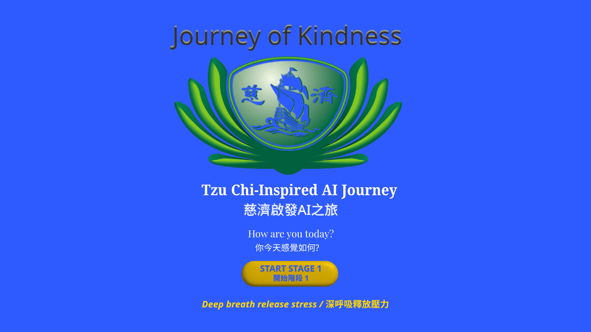
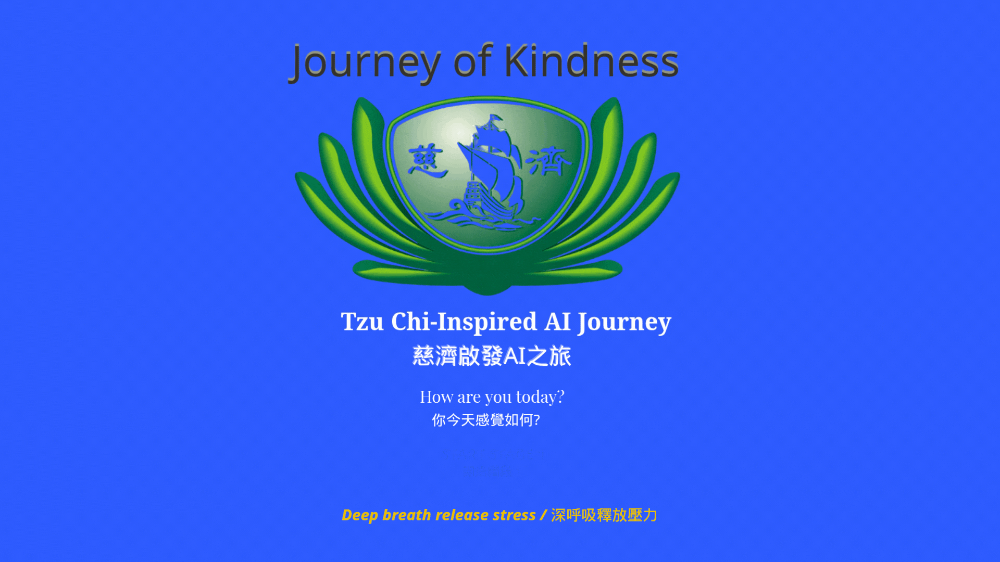
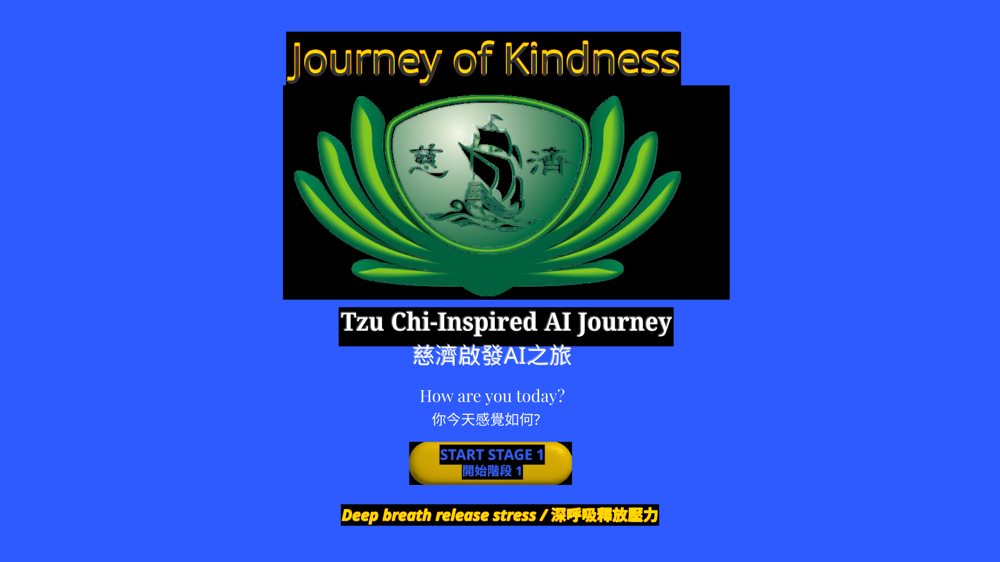
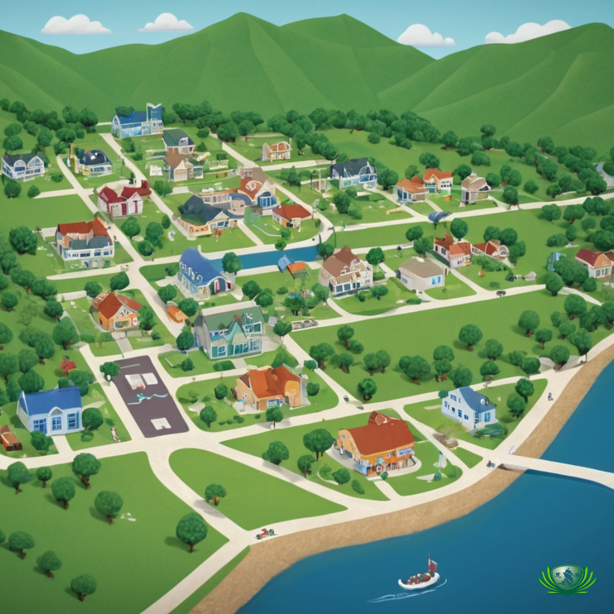

# 🌉 Journey of Kindness — Tzu Chi San Francisco

> 「慈濟之路 - 舊金山慈濟。真正的帝國不在土地，而在心靈的共鳴。」
> *The true empire is not of land, but of hearts in resonance.*

從舊金山出發，融合慈濟的善行精神、遊戲化設計與 AI 技術，我們打造一個讓新世代透過遊戲參與慈善、建立文化共鳴的數位平台。這源自我（Mei Hsien Hsu）的情感之旅：從晨光儀式與心情園圃擴展而出，旨在傳遞永恆善意，透過平台招募共創者並分享故事——包括我腎臟移植的轉化經歷，成為陪伴腎友的慈悲力量。

From San Francisco, blending Tzu Chi's compassionate spirit, gamification design, and AI technology, we create a digital platform for the new generation to participate in charity through games and build cultural resonance. This stems from my (Mei Hsien Hsu's) emotional journey: expanding from morning rituals and mood garden, aiming to spread enduring kindness, recruiting co-creators through the platform and sharing stories—including my kidney transplant transformation, becoming a compassionate support for kidney friends.

## Home Page Mockup (Canva Pro)

Animated Video (MP4 - Button Fade Up):
<video src="home_mockup.mp4" controls width="600"></video>
Animated GIF (Alternative):

Assets:
- Tzu Chi Logo: 
- Start Button: 

## Hunters Point Map Placeholder (Fooocus Diffusion)


## 🌱 Hi, I'm Mei Hsien Hsu — Designing Tools with Soul
As a Honors Transfer Program student at Las Positas College and dedicated Tzu Chi volunteer, I blend emotional literacy, AI, and science education to create meaningful, bilingual tools that support mental clarity and self-awareness. My journey began with a kidney transplant, turning pain into purpose: every two months, I lead Tzu Chi Northern California's kidney support group, sharing stories of resilience to uplift patients and families. This goodwill thread weaves through my work, reminding us that technology isn't just code—it's a vessel for compassion. This repo reflects my life's mission: making technology feel human-rooted in stories, soul, and goodwill, extending narratives through collaborative platforms.

### What I'm Building App: An interactive journey promoting Tzu Chi's contributions through AI-gamified modules, where personal stories like mine inspire engagement.
- **🌅 CompassionAI App**: An interactive journey promoting Tzu Chi's contributions through AI-gamified modules, where personal stories like mine inspire engagement.
- **🌱 Mood Garden Integration**: Symbolic emotion plants guiding tasks and meditation, now fused with Tzu Chi themes.
- **📚 Open-Source Ecosystem**: Tools to teach, inspire, and grow with the community, focusing on recruitment and story sharing.

## 🧩 Cultural & Ethical Roots — Tzu Chi Bay Area Journey of Goodness
本專案源自 **美國慈濟舊金山分會** 的「Journey of Goodness」願景，以數位互動與遊戲化任務，將慈濟的精神轉化為新世代可參與、可傳播的形式。強調陪伴而非幫助，培育感恩與永續，延伸個人故事——如我的移植經歷，轉化痛苦為力量，邀請你加入這份心靈共鳴。

This project stems from the **Journey of Goodness** by Tzu Chi San Francisco Branch's "Journey of Goodness" mission, using digital media to intersect with real-world interactions and gamified tasks to transform Tzu Chi's spirit into a form that the new generation can relate to and spread. Emphasizing companionship over help, nurturing gratitude and sustainability, extending personal stories—like my transplant experience, transforming pain into strength, inviting you to join this heart resonance in speed.

### 模組總覽 | Modules Overview
| Module | Description | Core Value | AI Integration (CS4 Alignment) |
|--------|-------------|------------|-------------------------------|
| 🌅 Morning Light | Morning startup ritual, setting daily intentions and emotion checks | Focus and clarity | Bayesian emotion prediction (>85% accuracy) |
| 🍵 Spiritual Tea | Tea ceremony interaction, promoting deep exchange and spiritual growth | Cultural connection | Logical reasoning and decision trees |
| 🌱 Virtue Seeds | Virtue seed tasks, cultivating long-term habits and character | Character development | NPS rewards and adversarial search |
| 🌸 Love Sprouting | Love action, spreading kindness to the community | Social impact | BFS/DFS resource optimization |
| 🌀 Ataraxy Portico | Universal gate of serenity, triggered post-tasks for reflection (pause witness, breath release, philosophical whispers, echo records, return gate) | Emotional reset and high-dimensional reflection | Intelligent agents and probabilistic transitions |

| 模組 | 描述 | 核心價值 | AI 整合 (CS4 Alignment) |
|------|------|----------|-------------------------|
| 🌅 Morning Light | 晨間啟動儀式，設定當日意圖與情緒檢查 | 專注與清明 | Bayesian 情緒預測 (>85% 準確) |
| 🍵 Spiritual Tea | 茶道互動，促進深度交流與靈性成長 | 文化連結 | 邏輯推理與決策樹 |
| 🌱 Virtue Seeds | 美德種子任務，培養長期習慣與品格 | 品格養成 | NPS 獎勵與對抗搜索 |
| 🌸 Love Sprouting | 愛心行動，擴散善意至社群 | 社會影響 | BFS/DFS 資源優化 |
| 🌀 Ataraxy Portico | 通用靜心之門，任務後觸發反思（暫停見證、呼吸釋放、哲學低語、回聲紀錄、重返之門） | 情緒復位與高維反思 | 智能代理與概率轉移 |

## 🎮 Design Philosophy | 設計哲學
- **Rapid Iteration**: Quick prototyping, testing, and optimization to build a minimum viable product (MVP) in about a week.
- **Branching Strategy Design**: Choices in the app affect subsequent tasks and interactions with the community.
- **Cultural Integration**: Games serve as bridges for sharing culture and spirituality, with AI helping to enhance the user experience.
- **Life Experience Fusion**: Incorporating my personal experiences (from kidney transplant challenges to community involvement) to recruit collaborators and help users feel the impact of transformation.
 
- **快速疊代**：快速原型、測試、優化——7天MVP，證明執行力。
- **策略設計**：每個選擇影響後續任務與社群互動。
- **高維度文化格局**：遊戲是文化與靈性的橋樑，AI是放大善意的工具，融合我的生命經歷（從腎臟移植的感情牽動，到社區行動），延伸故事並招募夥伴，讓每位玩家感受到轉化的力量。

## Current Progress (As of October 06, 2025)
The prototype is in early development, aligned with the semester timeline for completion by December 9, 2025. Key achievements:
- Completed initial literature review (10 sources on AI ethics, HCI, and gamification for social good—see references below).
- Designed technical architecture: User's journey modeled as a Search Problem with Informed Search; Propositional Logic for Knowledge Base of Jing Si Aphorisms; MDP for decision-making under uncertainty.
- Created home page mockup in Canva Pro (integrated bilingual elements, Tzu Chi logo, "How are you today?" prompt, start button—see mockup section above).
- Generated Hunters Point map placeholder in Fooocus (cartoon grid with paths for Stage 3 probabilistic reasoning, symbolizing aid transformation—see map above).
- Started index.html: Stage 1 (Inner Exploration) functional with user input for feelings, logic rules for aphorism display. Example code snippet (Propositional Logic simulation for rational agent reasoning):
  ```javascript:disable-run
  const knowledgeBase = {
    stressed: "Deep breath release stress. Calm your mind, and clarity will follow.",
    grateful: "Gratitude opens the door to abundance. Cherish what you have.",
    default: "Witness the moment without judgment. Carry this peace forward."
  };
  function reflect() {
    const input = document.getElementById('userInput').value.toLowerCase().trim();
    let aphorism = knowledgeBase.default;
    if (input.includes('stress')) aphorism = knowledgeBase.stressed;
    else if (input.includes('grate')) aphorism = knowledgeBase.grateful;
    document.getElementById('output').innerText = `Jing Si Aphorism: ${aphorism}`;
  }
  ```
- Ethical considerations: Addressing AI bias in aphorism selection via diverse entries.
- Next steps: Complete Stage 1 by October 21; integrate full AI logic by end of semester for GitHub Pages deployment.

This progress ensures the game lands as a functional proof-of-concept by semester end, with full deliverables: Deployed prototype and 12-page APA research paper (draft in progress, including code explanations and ethical discussions).

## 🤝 Co-Creation Invitation | 共創邀請
We are looking for:
- Technical co-creators (React, n8n, automation, AI integration)
- Cultural curators (philosophy, ritual design, story writing)
- Community guides (guiding player interactions and emotional connections)
If my story moves you, welcome to share your experiences and weave this web of kindness together!
📜 [Fill out the Ideological Resonance Questionnaire](https://forms.gle/gJR4aDsk3FvFiYHV6)
📚 [View Notion Guide Page](https://stealth-ozraraptor-79b.notion.site/Journey-of-Kindness-26de4a757424806aa4a3f88cfae61b27?pvs=143) (Contains more emotional story extensions)

我們正在尋找：
- 技術共創者（React、n8n、自動化、AI 整合）
- 文化策展人（哲學、儀式設計、故事編寫）
- 社群引路人（引導玩家互動與情感連結）
如果你被我的故事打動，歡迎分享你的經歷，一起織就這份善意網！
📜 [填寫理念共鳴問卷](https://forms.gle/gJR4aDsk3FvFiYHV6)
📚 [查看 Notion 導引頁](https://stealth-ozraraptor-79b.notion.site/Journey-of-Kindness-26de4a757424806aa4a3f88cfae61b27?pvs=143)（內含更多感情故事延伸）

## 📅 Milestones | 里程碑
- **9/12 (Pre-Project Setup)**: README + Notion framework complete | 9/12 (前置準備)：README + Notion 架構完成
- **9/13–9/14 (Pre-Project Setup)**: React Ataraxy Portico page and trigger logic | 9/13–9/14 (前置準備)：React Ataraxy Portico 頁面與觸發邏輯
- **9/15 (Pre-Project Setup)**: n8n webhook + Notion API integration | 9/15 (前置準備)：n8n webhook + Notion API 整合
- **9/16–9/17 (Pre-Project Setup)**: Quote library expansion + AI simulation | 9/16–9/17 (前置準備)：語錄庫擴充 + AI 模擬
- **9/18–9/30 (Completed)**: Submit revised Honors contract. Complete initial literature review and technical architecture design. | 9/18–9/30 (已完成)：提交修訂 Honors 合約。完成初步文獻回顧與技術架構設計。
- **9/30–10/21**: Complete Stage 1 "Inner Exploration" (Knowledge Representation with Propositional Logic for aphorisms). | 9/30–10/21：完成階段 1 「內在探索」（知識表示，使用命題邏輯處理靜思語錄）。
- **10/22–11/11**: Complete Stage 2 "Graceful Action" (Informed Search algorithm for guiding actions). | 10/22–11/11：完成階段 2 「優雅行動」（知情搜尋演算法引導行動）。
- **11/12–11/25**: Complete Stages 3 & 4 (Bayesian Reasoning and MDP for reflection/decision-making). Submit draft research paper. | 11/12–11/25：完成階段 3 & 4 （貝氏推理與 MDP 用於反思/決策）。提交研究論文初稿。
- **11/26–12/09**: Finalize prototype deployment on GitHub Pages, submit revised paper, prepare presentation. | 11/26–12/09：完成原型部署於 GitHub Pages，提交修訂論文，準備演示。

**Current Status (As of 10/06/2025)**: Post-9/30 milestone achieved—literature review done, architecture designed, home mockup and Hunters Point map created, Stage 1 code started. On track for 10/21. | **目前狀態 (截至 2025/10/06)**：9/30 里程碑已達成—文獻回顧完成、架構設計、首頁 mockup 與 Hunters Point 地圖建立、階段 1 程式碼啟動。正朝 10/21 前進。

## Getting Started
1. Clone: `git clone https://github.com/AAdl11/meihsien.git`
2. Run: Open index.html in browser (no installs needed).
3. Contribute: See CONTRIBUTING.md—join like Musk's team to enhance AI, add voice/AR, or Tzu Chi stories for global impact.

## Contact
Reach me via GitHub issues or hsu.meihsien@gmail.com

---

## Honors Project Contract Summary
(For reference—aligned with CS 4 lab-style format for clarity)

**Objectives:**
- Apply AI concepts from CS 4 (informed search, propositional logic, Bayesian networks, MDP) to gamify Tzu Chi outreach.
- Manipulate data with arrays/objects for aphorisms and states.
- Handle errors in web interactions.
- Build prototype with HTML/CSS/JS per textbook.

**Description:**
Menu-driven app with options: 1. Show All Progress; 2. Advance/Reflect; 3. Search Aphorisms; 4. Filter by Score; 5. Exit. Transforms Tzu Chi mission into immersive journey.

**Requirements & Error Handling:** As detailed in contract (no globals, in-browser only, case-insensitive searches, invalid input checks).

**Sample Run:** See contract for simulated interactions.

**Timeline:**
- Sept 30: Revised contract, literature review, design.
- Oct 21: Stage 1 complete.
- Nov 11: Stage 2.
- Nov 25: Stages 3-4, draft paper.
- Dec 9: Final prototype/paper, presentation.

I will meet with the instructor every 3 weeks.

Honors Student: Meihsien Hsu  
Project Mentor: An Lam

## References (From Literature Review)
- Boutilier, C., Dean, T., & Hanks, S. (1999). Decision-theoretic planning: Structural assumptions and computational leverage. *Journal of Artificial Intelligence Research*, 11, 1-94.
- Christakis, N. A., & Fowler, J. H. (2011). Connected: The surprising power of our social networks. *Back Bay Books*.
- Floridi, L., et al. (2021). AI4People—An ethical framework for a good AI society. *Minds and Machines*, 28(4), 689-707.
- Hamari, J., Koivisto, J., & Sarsa, H. (2014). Does gamification work? *2014 47th Hawaii International Conference on System Sciences*, 3025-3034.
- Kahneman, D., Slovic, P., & Tversky, A. (1982). *Judgment under uncertainty: Heuristics and biases*. Cambridge University Press.
- Kirkwood, A. (2011). Tactical games approach. *Science.gov*.
- Markopoulos, P., et al. (2009). Ambient intelligence research in home lab. *CHI 2020 Proceedings*.
- Pang, B., & Lee, L. (2008). Opinion mining and sentiment analysis. *Foundations and Trends in Information Retrieval*, 2(1-2), 1-135.
- Russell, S., & Norvig, P. (2021). *Artificial intelligence: A modern approach* (4th ed.). Pearson.
- Sailer, M., et al. (2013). Psychological perspectives on motivation through gamification. *Interaction Design and Architecture Journal*, 19, 28-37.
- Schöbel, S., Janson, A., & Söllner, M. (2020). Capturing the complexity of gamification elements. *European Journal of Information Systems*, 29(6), 641-668.
- Seaborn, K., & Fels, D. I. (2015). Gamification in theory and action. *International Journal of Human-Computer Studies*, 74, 14-31.
```
